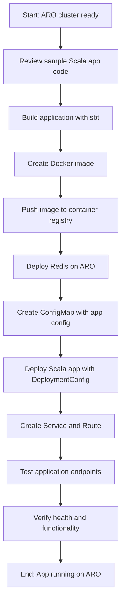

# Module 09: Deploy Sample Scala App on ARO

## Module Workflow

1. Set up the sample Scala application structure
2. Build the Scala application with sbt
3. Create Docker image with multi-stage build
4. Deploy Redis on ARO
5. Create OpenShift manifests (DeploymentConfig, Service, Route, ConfigMap)
6. Deploy the Scala application to ARO
7. Test the application endpoints
8. Verify application is running correctly



> [!NOTE] 
> This module deploys a sample Akka HTTP-based Scala application on your ARO cluster. The application demonstrates common OpenShift features like Routes, DeploymentConfigs, and ConfigMaps that will later be converted to standard Kubernetes resources when migrating to AKS.

## Prerequisites

- Completed Module 00, 01 (a or b), and 02
- ARO cluster deployed and accessible
- `oc` CLI configured and logged in as cluster admin
- Docker or Podman installed on your management node
- Container registry accessible (Docker Hub, Quay.io, or ACR)

## Application Architecture

The sample application includes:

- **Akka HTTP REST API** with the following endpoints:
  - `GET /health` - Health check endpoint
  - `GET /api/messages` - List cached messages from Redis
  - `POST /api/messages` - Add a new message to Redis cache
  - `GET /api/info` - Display application configuration from ConfigMap

- **Redis** - For caching and session storage
- **ConfigMap** - For application configuration
- **OpenShift Route** - For external access

## Step 1: Review Sample Application Code

The sample Scala application is located in `scripts/sample-scala-app/`. Let's review its structure:

```bash
cd /workspaces/MSFT-OpenShift-to-AKS/scripts/sample-scala-app
tree
```

Expected structure:
```
sample-scala-app/
├── src/
│   ├── main/
│   │   ├── scala/
│   │   │   └── com/example/
│   │   │       ├── Main.scala           # Akka HTTP server
│   │   │       ├── Routes.scala         # API routes
│   │   │       ├── models/
│   │   │       │   └── Message.scala    # Case classes
│   │   │       └── services/
│   │   │           └── RedisService.scala
│   │   └── resources/
│   │       └── application.conf         # Akka config
│   └── test/
│       └── scala/
│           └── com/example/
│               └── RoutesSpec.scala
├── project/
│   ├── build.properties
│   └── plugins.sbt
├── build.sbt
├── Dockerfile
├── openshift/
│   ├── redis-deployment.yaml
│   ├── redis-service.yaml
│   ├── deployment-config.yaml
│   ├── service.yaml
│   ├── route.yaml
│   └── configmap.yaml
└── README.md
```

> [!TIP]
> The application code is already provided in the repository. Review the key files to understand how the Akka HTTP server, Redis integration, and route handlers work.

## Step 2: Build the Scala Application

1. **Ensure sbt and JDK are installed:**

```bash
# Check Java version (JDK 11 or 17 required)
java -version

# Check sbt installation
sbt --version
```

If not installed, install them:

```bash
# Install SDKMAN for managing JDK versions
curl -s "https://get.sdkman.io" | bash
source "$HOME/.sdkman/bin/sdkman-init.sh"

# Install JDK 17
sdk install java 17.0.9-tem

# Install sbt
echo "deb https://repo.scala-sbt.org/scalasbt/debian all main" | sudo tee /etc/apt/sources.list.d/sbt.list
curl -sL "https://keyserver.ubuntu.com/pks/lookup?op=get&search=0x2EE0EA64E40A89B84B2DF73499E82A75642AC823" | sudo apt-key add
sudo apt-get update
sudo apt-get install sbt
```

2. **Build the application:**

```bash
cd scripts/sample-scala-app
sbt clean compile test package
```

Expected output:
```
[info] All tests passed.
[success] Total time: 45 s
```

## Step 3: Build Docker Image

1. **Review the Dockerfile:**

```bash
cat Dockerfile
```

The multi-stage Dockerfile:
- **Stage 1**: Compiles and packages the Scala application with sbt
- **Stage 2**: Creates a minimal runtime image with only the JRE and JAR

2. **Set your container registry variables:**

```bash
# For Docker Hub
export REGISTRY="docker.io/<your-dockerhub-username>"

# OR for Azure Container Registry
export REGISTRY="<your-acr-name>.azurecr.io"

# OR for Quay.io
export REGISTRY="quay.io/<your-username>"

export APP_NAME="scala-app"
export APP_VERSION="1.0.0"
```

3. **Build the Docker image:**

```bash
docker build -t ${REGISTRY}/${APP_NAME}:${APP_VERSION} .
```

> [!NOTE]
> The build may take 5-10 minutes on first run as it downloads dependencies.

4. **Test the image locally (optional):**

```bash
# Run Redis locally
docker run -d --name redis -p 6379:6379 redis:7-alpine

# Run the Scala app
docker run -d --name scala-app -p 8080:8080 \
  -e REDIS_HOST=host.docker.internal \
  -e REDIS_PORT=6379 \
  ${REGISTRY}/${APP_NAME}:${APP_VERSION}

# Test the health endpoint
curl http://localhost:8080/health

# Cleanup
docker stop scala-app redis
docker rm scala-app redis
```

5. **Push the image to your registry:**

```bash
# Login to your registry
docker login ${REGISTRY}

# Push the image
docker push ${REGISTRY}/${APP_NAME}:${APP_VERSION}
```

## Step 4: Create OpenShift Project

1. **Login to your ARO cluster:**

```bash
# Get credentials
az aro list-credentials \
  --name <your-cluster-name> \
  --resource-group <your-resource-group>

# Get API server URL
ARO_API_SERVER=$(az aro show \
  --name <your-cluster-name> \
  --resource-group <your-resource-group> \
  --query apiserverProfile.url -o tsv)

# Login
oc login $ARO_API_SERVER -u kubeadmin -p <password-from-credentials>
```

2. **Create a new project:**

```bash
oc new-project scala-demo
```

Expected output:
```
Now using project "scala-demo" on server "https://api.<cluster>.openshift.com:6443".
```

## Step 5: Deploy Redis on ARO

1. **Deploy Redis using the provided manifests:**

```bash
cd scripts/sample-scala-app/openshift

# Deploy Redis
oc apply -f redis-deployment.yaml
oc apply -f redis-service.yaml
```

2. **Verify Redis is running:**

```bash
oc get pods -l app=redis
```

Expected output:
```
NAME                     READY   STATUS    RESTARTS   AGE
redis-7d6f8c9b5f-x7j2k   1/1     Running   0          30s
```

## Step 6: Create Application ConfigMap

1. **Review the ConfigMap:**

```bash
cat configmap.yaml
```

2. **Update values if needed, then create:**

```bash
oc apply -f configmap.yaml
```

3. **Verify the ConfigMap:**

```bash
oc get configmap scala-app-config -o yaml
```

## Step 7: Deploy Scala Application

1. **Update the DeploymentConfig with your image:**

```bash
# Edit the deployment-config.yaml
sed -i "s|IMAGE_PLACEHOLDER|${REGISTRY}/${APP_NAME}:${APP_VERSION}|g" deployment-config.yaml
```

Or manually edit `deployment-config.yaml` and update the image field:

```yaml
spec:
  template:
    spec:
      containers:
      - name: scala-app
        image: <your-registry>/scala-app:1.0.0  # Update this line
```

2. **Create the DeploymentConfig:**

```bash
oc apply -f deployment-config.yaml
```

3. **Monitor the deployment:**

```bash
# Watch the pods
oc get pods -w

# Check deployment status
oc rollout status dc/scala-app
```

Expected output:
```
deployment "scala-app-1" successfully rolled out
```

4. **Check the logs:**

```bash
oc logs -f deployment/scala-app
```

Look for:
```
Server online at http://0.0.0.0:8080/
```

## Step 8: Create Service and Route

1. **Create the Service:**

```bash
oc apply -f service.yaml
```

2. **Verify the Service:**

```bash
oc get svc scala-app
```

3. **Create the OpenShift Route:**

```bash
oc apply -f route.yaml
```

4. **Get the Route URL:**

```bash
export ROUTE_URL=$(oc get route scala-app -o jsonpath='{.spec.host}')
echo "Application URL: https://${ROUTE_URL}"
```

## Step 9: Test the Application

1. **Test the health endpoint:**

```bash
curl https://${ROUTE_URL}/health
```

Expected output:
```json
{"status":"healthy","timestamp":"2025-11-19T10:30:00Z"}
```

2. **Get application info from ConfigMap:**

```bash
curl https://${ROUTE_URL}/api/info
```

Expected output:
```json
{
  "app": "Scala Demo App",
  "version": "1.0.0",
  "environment": "development"
}
```

3. **Add a message to Redis:**

```bash
curl -X POST https://${ROUTE_URL}/api/messages \
  -H "Content-Type: application/json" \
  -d '{"text":"Hello from ARO!","author":"Admin"}'
```

Expected output:
```json
{
  "id": "1",
  "text": "Hello from ARO!",
  "author": "Admin",
  "timestamp": "2025-11-19T10:31:00Z"
}
```

4. **List all messages:**

```bash
curl https://${ROUTE_URL}/api/messages
```

Expected output:
```json
{
  "messages": [
    {
      "id": "1",
      "text": "Hello from ARO!",
      "author": "Admin",
      "timestamp": "2025-11-19T10:31:00Z"
    }
  ],
  "count": 1
}
```

## Step 10: Verify Deployment

1. **Check all resources:**

```bash
oc get all -l app=scala-app
```

2. **View the DeploymentConfig details:**

```bash
oc describe dc/scala-app
```

3. **Check ConfigMap is mounted:**

```bash
oc describe pod -l app=scala-app | grep -A 5 "Mounts:"
```

4. **Verify Redis connectivity:**

```bash
oc rsh deployment/scala-app

# Inside the pod
curl http://redis:6379
exit
```

## Troubleshooting

### Pod Not Starting

```bash
# Check pod status
oc get pods -l app=scala-app

# View pod events
oc describe pod -l app=scala-app

# Check logs
oc logs -l app=scala-app
```

### Image Pull Errors

```bash
# Verify image exists
docker pull ${REGISTRY}/${APP_NAME}:${APP_VERSION}

# Check image pull secret if using private registry
oc get secrets

# Create image pull secret if needed
oc create secret docker-registry registry-secret \
  --docker-server=${REGISTRY} \
  --docker-username=<username> \
  --docker-password=<password> \
  --docker-email=<email>

# Link secret to default service account
oc secrets link default registry-secret --for=pull
```

### Redis Connection Issues

```bash
# Test Redis service
oc run redis-test --image=redis:7-alpine --rm -it -- redis-cli -h redis ping

# Check Redis logs
oc logs deployment/redis

# Verify service DNS
oc run dns-test --image=busybox --rm -it -- nslookup redis
```

### Route Not Accessible

```bash
# Verify route is created
oc get route scala-app

# Check route status
oc describe route scala-app

# Test internal service access
oc run curl-test --image=curlimages/curl --rm -it -- curl http://scala-app:8080/health
```

## Key OpenShift Features Used

This deployment demonstrates several OpenShift-specific features that we'll convert in Module 11:

| Feature | Purpose | AKS Equivalent |
|---------|---------|----------------|
| **DeploymentConfig** | Application deployment with triggers | Deployment |
| **Route** | External access with TLS | Ingress |
| **ImageStream** | Container image management | ACR + Deployment |
| **ConfigMap** | Configuration management | ConfigMap (same) |
| **Service** | Internal networking | Service (same) |

## Cleanup (Optional)

To remove the application but keep the project:

```bash
oc delete all,configmap -l app=scala-app
oc delete all,configmap -l app=redis
```

To delete the entire project:

```bash
oc delete project scala-demo
```

## Next Steps

✅ **Completed:** Sample Scala application is now running on ARO with Redis backing

➡️ **Next Module:** [Module 10 - Setup AKS Cluster](Module-10-setup-aks-cluster.md)

In the next module, you will:
- Deploy an Azure Kubernetes Service (AKS) cluster
- Set up Azure Container Registry (ACR)
- Configure ingress controller
- Prepare for application migration

## References

- [OpenShift DeploymentConfig Documentation](https://docs.openshift.com/container-platform/latest/applications/deployments/what-deployments-are.html)
- [OpenShift Routes](https://docs.openshift.com/container-platform/latest/networking/routes/route-configuration.html)
- [Akka HTTP Documentation](https://doc.akka.io/docs/akka-http/current/)
- [Redis on Kubernetes](https://redis.io/docs/stack/get-started/install/docker/)
