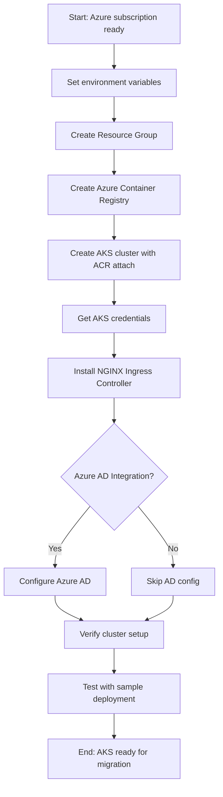

# Module 10: Setup AKS Cluster

## Module Workflow

1. Prepare Azure environment and set variables
2. Create Azure Resource Group
3. Create Azure Container Registry (ACR)
4. Create AKS cluster with ACR integration
5. Install and configure kubectl
6. Install NGINX Ingress Controller
7. Configure Azure AD integration (optional)
8. Verify cluster setup
9. Test basic deployment



> [!NOTE] 
> This module sets up an Azure Kubernetes Service (AKS) cluster that will serve as the migration target for the Scala application currently running on ARO. The AKS cluster will be configured with Azure Container Registry integration and an ingress controller for external access.

## Prerequisites

- Completed Modules 00, 01, 02, and 09
- Scala application running on ARO
- Azure CLI installed and configured
- Sufficient Azure subscription quota for AKS
- kubectl CLI tool (will be installed if needed)

## Azure Resources Overview

This module creates:
- **Resource Group** - Container for all AKS resources
- **Azure Container Registry (ACR)** - Private container image registry
- **AKS Cluster** - Managed Kubernetes cluster
- **NGINX Ingress Controller** - For routing external traffic
- **Public IP** - For ingress controller (automatically created)

## Step 1: Set Environment Variables

1. **Define your Azure environment variables:**

```bash
# Resource naming
export LOCATION="eastus"
export RESOURCE_GROUP="rg-aks-migration-demo"
export ACR_NAME="acrmigrationdemo$(date +%s)"  # Must be globally unique
export AKS_CLUSTER_NAME="aks-migration-demo"

# AKS configuration
export AKS_NODE_COUNT=3
export AKS_NODE_SIZE="Standard_DS2_v2"
export KUBERNETES_VERSION="1.28.3"  # Or latest stable

# Optional: Tags for cost tracking
export TAGS="environment=demo project=aro-to-aks-migration owner=<your-name>"

echo "Configuration:"
echo "  Location: $LOCATION"
echo "  Resource Group: $RESOURCE_GROUP"
echo "  ACR Name: $ACR_NAME"
echo "  AKS Cluster: $AKS_CLUSTER_NAME"
```

2. **Verify Azure CLI login:**

```bash
az account show
```

If not logged in:

```bash
az login
```

3. **Set the correct subscription (if you have multiple):**

```bash
# List subscriptions
az account list --output table

# Set active subscription
az account set --subscription "<subscription-id-or-name>"
```

## Step 2: Create Resource Group

```bash
az group create \
  --name $RESOURCE_GROUP \
  --location $LOCATION \
  --tags $TAGS
```

Expected output:
```json
{
  "id": "/subscriptions/.../resourceGroups/rg-aks-migration-demo",
  "location": "eastus",
  "name": "rg-aks-migration-demo",
  "properties": {
    "provisioningState": "Succeeded"
  }
}
```

## Step 3: Create Azure Container Registry

1. **Create the ACR:**

```bash
az acr create \
  --resource-group $RESOURCE_GROUP \
  --name $ACR_NAME \
  --sku Standard \
  --location $LOCATION \
  --admin-enabled false
```

> [!NOTE]
> Creating ACR typically takes 1-2 minutes.

2. **Verify ACR creation:**

```bash
az acr show --name $ACR_NAME --resource-group $RESOURCE_GROUP --query "{Name:name,LoginServer:loginServer,Sku:sku.name}" --output table
```

Expected output:
```
Name                    LoginServer                              Sku
----------------------  ---------------------------------------  --------
acrmigrationdemo12345   acrmigrationdemo12345.azurecr.io         Standard
```

3. **Save ACR login server for later use:**

```bash
export ACR_LOGIN_SERVER=$(az acr show --name $ACR_NAME --resource-group $RESOURCE_GROUP --query loginServer --output tsv)
echo "ACR Login Server: $ACR_LOGIN_SERVER"
```

## Step 4: Create AKS Cluster

1. **Create AKS cluster with ACR integration:**

```bash
az aks create \
  --resource-group $RESOURCE_GROUP \
  --name $AKS_CLUSTER_NAME \
  --location $LOCATION \
  --node-count $AKS_NODE_COUNT \
  --node-vm-size $AKS_NODE_SIZE \
  --kubernetes-version $KUBERNETES_VERSION \
  --enable-managed-identity \
  --attach-acr $ACR_NAME \
  --network-plugin azure \
  --network-policy azure \
  --load-balancer-sku standard \
  --enable-addons monitoring \
  --generate-ssh-keys \
  --tags $TAGS
```

> [!IMPORTANT]
> AKS cluster creation takes 5-10 minutes. The `--attach-acr` flag automatically grants the AKS cluster permission to pull images from ACR.

Expected output (abbreviated):
```
{
  "id": "/subscriptions/.../resourcegroups/rg-aks-migration-demo/providers/Microsoft.ContainerService/managedClusters/aks-migration-demo",
  "location": "eastus",
  "name": "aks-migration-demo",
  "provisioningState": "Succeeded",
  ...
}
```

2. **Monitor the creation (optional):**

```bash
# In another terminal
watch -n 10 "az aks show --resource-group $RESOURCE_GROUP --name $AKS_CLUSTER_NAME --query 'provisioningState' --output tsv"
```

## Step 5: Configure kubectl

1. **Install kubectl if not already installed:**

```bash
# Check if kubectl is installed
kubectl version --client

# If not installed, install via Azure CLI
az aks install-cli
```

2. **Get AKS credentials:**

```bash
az aks get-credentials \
  --resource-group $RESOURCE_GROUP \
  --name $AKS_CLUSTER_NAME \
  --overwrite-existing
```

Expected output:
```
Merged "aks-migration-demo" as current context in /home/user/.kube/config
```

3. **Verify cluster access:**

```bash
kubectl get nodes
```

Expected output:
```
NAME                                STATUS   ROLES   AGE   VERSION
aks-nodepool1-12345678-vmss000000   Ready    agent   5m    v1.28.3
aks-nodepool1-12345678-vmss000001   Ready    agent   5m    v1.28.3
aks-nodepool1-12345678-vmss000002   Ready    agent   5m    v1.28.3
```

4. **Check cluster info:**

```bash
kubectl cluster-info
kubectl get namespaces
kubectl get pods --all-namespaces
```

## Step 6: Install NGINX Ingress Controller

1. **Add the ingress-nginx Helm repository:**

```bash
# Install Helm if not already installed
curl https://raw.githubusercontent.com/helm/helm/main/scripts/get-helm-3 | bash

# Add Helm repo
helm repo add ingress-nginx https://kubernetes.github.io/ingress-nginx
helm repo update
```

2. **Create namespace for ingress:**

```bash
kubectl create namespace ingress-nginx
```

3. **Install NGINX Ingress Controller:**

```bash
helm install ingress-nginx ingress-nginx/ingress-nginx \
  --namespace ingress-nginx \
  --set controller.replicaCount=2 \
  --set controller.nodeSelector."kubernetes\.io/os"=linux \
  --set controller.service.annotations."service\.beta\.kubernetes\.io/azure-load-balancer-health-probe-request-path"=/healthz \
  --set defaultBackend.nodeSelector."kubernetes\.io/os"=linux
```

> [!NOTE]
> The ingress controller deployment takes 2-3 minutes. It will create an Azure Load Balancer with a public IP.

4. **Wait for the external IP to be assigned:**

```bash
kubectl --namespace ingress-nginx get services ingress-nginx-controller --watch
```

Wait until you see an EXTERNAL-IP (not `<pending>`):

```
NAME                       TYPE           CLUSTER-IP     EXTERNAL-IP      PORT(S)
ingress-nginx-controller   LoadBalancer   10.0.123.45    20.12.34.56      80:31234/TCP,443:32345/TCP
```

Press `Ctrl+C` to stop watching.

5. **Save the ingress IP:**

```bash
export INGRESS_IP=$(kubectl --namespace ingress-nginx get services ingress-nginx-controller -o jsonpath='{.status.loadBalancer.ingress[0].ip}')
echo "Ingress Controller IP: $INGRESS_IP"
```

6. **Verify ingress controller is running:**

```bash
kubectl get pods --namespace ingress-nginx
kubectl logs --namespace ingress-nginx -l app.kubernetes.io/name=ingress-nginx
```

## Step 7: Configure Azure AD Integration (Optional)

> [!TIP]
> Azure AD integration provides enterprise-grade authentication and RBAC. Skip this section if you're doing a quick demo.

1. **Enable Azure AD integration:**

```bash
az aks update \
  --resource-group $RESOURCE_GROUP \
  --name $AKS_CLUSTER_NAME \
  --enable-aad \
  --aad-admin-group-object-ids <your-ad-group-id>
```

2. **Configure RBAC (example):**

```bash
# Create a namespace-scoped role binding
kubectl create rolebinding developer-binding \
  --clusterrole=edit \
  --user=<user@domain.com> \
  --namespace=scala-demo
```

3. **Test Azure AD authentication:**

```bash
# Get credentials with Azure AD
az aks get-credentials \
  --resource-group $RESOURCE_GROUP \
  --name $AKS_CLUSTER_NAME \
  --overwrite-existing

# This will prompt for Azure AD login
kubectl get nodes
```

## Step 8: Verify Cluster Setup

1. **Run a comprehensive cluster check:**

```bash
# Check cluster health
kubectl get --raw='/readyz?verbose'

# Check node status
kubectl get nodes -o wide

# Check system pods
kubectl get pods --namespace kube-system

# Check ingress controller
kubectl get all --namespace ingress-nginx

# View cluster resource usage
kubectl top nodes
```

2. **Create a test namespace:**

```bash
kubectl create namespace test-deployment
```

3. **Verify ACR integration:**

```bash
# The AKS cluster should have permission to pull from ACR
az aks check-acr \
  --resource-group $RESOURCE_GROUP \
  --name $AKS_CLUSTER_NAME \
  --acr $ACR_LOGIN_SERVER
```

Expected output:
```
The ACR 'acrmigrationdemo12345.azurecr.io' is reachable from the AKS cluster 'aks-migration-demo'.
```

## Step 9: Test Basic Deployment

1. **Deploy a test NGINX application:**

```bash
cat <<EOF | kubectl apply -f -
apiVersion: apps/v1
kind: Deployment
metadata:
  name: nginx-test
  namespace: test-deployment
spec:
  replicas: 2
  selector:
    matchLabels:
      app: nginx-test
  template:
    metadata:
      labels:
        app: nginx-test
    spec:
      containers:
      - name: nginx
        image: nginx:alpine
        ports:
        - containerPort: 80
---
apiVersion: v1
kind: Service
metadata:
  name: nginx-test
  namespace: test-deployment
spec:
  selector:
    app: nginx-test
  ports:
  - port: 80
    targetPort: 80
---
apiVersion: networking.k8s.io/v1
kind: Ingress
metadata:
  name: nginx-test
  namespace: test-deployment
  annotations:
    nginx.ingress.kubernetes.io/rewrite-target: /
spec:
  ingressClassName: nginx
  rules:
  - host: test.${INGRESS_IP}.nip.io
    http:
      paths:
      - path: /
        pathType: Prefix
        backend:
          service:
            name: nginx-test
            port:
              number: 80
EOF
```

2. **Wait for pods to be ready:**

```bash
kubectl wait --for=condition=ready pod -l app=nginx-test --namespace=test-deployment --timeout=60s
```

3. **Test the deployment:**

```bash
curl http://test.${INGRESS_IP}.nip.io
```

Expected output: NGINX welcome page HTML

4. **Check ingress:**

```bash
kubectl get ingress --namespace=test-deployment
```

5. **Cleanup test deployment:**

```bash
kubectl delete namespace test-deployment
```

## Step 10: Prepare for Migration

1. **Create namespace for Scala application:**

```bash
kubectl create namespace scala-demo
```

2. **Configure kubectl context:**

```bash
# Set default namespace
kubectl config set-context --current --namespace=scala-demo

# Verify
kubectl config get-contexts
```

3. **Create a credentials script for easy access:**

```bash
cat > ~/aks-login.sh <<'EOF'
#!/bin/bash
# AKS Login Script
az aks get-credentials \
  --resource-group $RESOURCE_GROUP \
  --name $AKS_CLUSTER_NAME \
  --overwrite-existing

kubectl config set-context --current --namespace=scala-demo
echo "Connected to AKS cluster: $AKS_CLUSTER_NAME"
echo "Current namespace: scala-demo"
kubectl get nodes
EOF

chmod +x ~/aks-login.sh
```

## Deployment Script (Automated)

For convenience, a deployment script is provided in `scripts/aks-deploy/setup-aks-cluster.sh`:

```bash
cd /workspaces/MSFT-OpenShift-to-AKS/scripts/aks-deploy
./setup-aks-cluster.sh
```

## Comparison: AKS vs ARO

| Feature | ARO (OpenShift) | AKS (Kubernetes) |
|---------|-----------------|------------------|
| **Ingress** | Routes (built-in) | Ingress Controller (must install) |
| **Registry** | Internal registry | ACR integration |
| **Web Console** | OpenShift Console | Kubernetes Dashboard (optional) |
| **User Auth** | Built-in OAuth | Azure AD integration |
| **Deployment** | DeploymentConfig | Deployment |
| **CLI** | `oc` (superset of kubectl) | `kubectl` |
| **Networking** | OpenShift SDN | Azure CNI or Kubenet |
| **Monitoring** | Built-in monitoring | Azure Monitor |

## Troubleshooting

### AKS Creation Fails

```bash
# Check quota limits
az vm list-usage --location $LOCATION --output table

# View detailed error
az aks show --resource-group $RESOURCE_GROUP --name $AKS_CLUSTER_NAME
```

### Cannot Access Cluster

```bash
# Re-fetch credentials
az aks get-credentials --resource-group $RESOURCE_GROUP --name $AKS_CLUSTER_NAME --overwrite-existing

# Check cluster status
az aks show --resource-group $RESOURCE_GROUP --name $AKS_CLUSTER_NAME --query "provisioningState"

# Verify kubectl config
kubectl config view
kubectl config current-context
```

### Ingress Controller Not Getting External IP

```bash
# Check service
kubectl get svc --namespace ingress-nginx

# Check pods
kubectl get pods --namespace ingress-nginx

# View events
kubectl get events --namespace ingress-nginx --sort-by='.lastTimestamp'

# Check Azure Load Balancer
az network lb list --resource-group MC_${RESOURCE_GROUP}_${AKS_CLUSTER_NAME}_${LOCATION} --output table
```

### ACR Access Issues

```bash
# Verify ACR integration
az aks check-acr --resource-group $RESOURCE_GROUP --name $AKS_CLUSTER_NAME --acr $ACR_NAME

# Manually attach ACR if needed
az aks update --resource-group $RESOURCE_GROUP --name $AKS_CLUSTER_NAME --attach-acr $ACR_NAME
```

## Cost Management

1. **View estimated costs:**

```bash
az consumption usage list --start-date $(date -d '7 days ago' +%Y-%m-%d) --end-date $(date +%Y-%m-%d) | grep -i kubernetes
```

2. **Stop AKS cluster (to save costs during testing):**

```bash
az aks stop --resource-group $RESOURCE_GROUP --name $AKS_CLUSTER_NAME
```

3. **Start AKS cluster:**

```bash
az aks start --resource-group $RESOURCE_GROUP --name $AKS_CLUSTER_NAME
```

4. **Delete resources when done:**

```bash
# Delete everything
az group delete --name $RESOURCE_GROUP --yes --no-wait
```

## Next Steps

✅ **Completed:** AKS cluster is deployed and ready for application migration

➡️ **Next Module:** [Module 11 - Migrate App from ARO to AKS](Module-11-migrate-app-to-aks.md)

In the next module, you will:
- Convert OpenShift manifests to Kubernetes manifests
- Migrate container images to ACR
- Deploy the Scala application on AKS
- Compare routing, configuration, and operational differences

## Useful Commands Reference

```bash
# AKS Management
az aks list --output table
az aks show --resource-group $RESOURCE_GROUP --name $AKS_CLUSTER_NAME
az aks get-versions --location $LOCATION --output table

# Cluster Operations
kubectl get nodes
kubectl get pods --all-namespaces
kubectl top nodes
kubectl top pods --all-namespaces

# ACR Operations
az acr list --output table
az acr repository list --name $ACR_NAME
az acr repository show-tags --name $ACR_NAME --repository scala-app

# Ingress
kubectl get ingress --all-namespaces
kubectl describe ingress <ingress-name> -n <namespace>
```

## References

- [AKS Documentation](https://learn.microsoft.com/en-us/azure/aks/)
- [Azure Container Registry Documentation](https://learn.microsoft.com/en-us/azure/container-registry/)
- [NGINX Ingress Controller](https://kubernetes.github.io/ingress-nginx/)
- [Azure AD Integration for AKS](https://learn.microsoft.com/en-us/azure/aks/azure-ad-integration-cli)
- [kubectl Cheat Sheet](https://kubernetes.io/docs/reference/kubectl/cheatsheet/)
