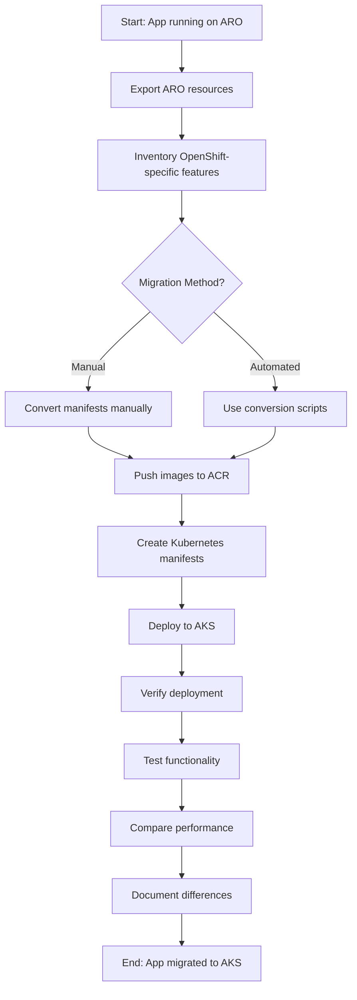

# Module 11: Migrate Application from ARO to AKS

## Module Workflow

1. Assess current ARO deployment
2. Export OpenShift resources
3. Convert OpenShift-specific resources to Kubernetes equivalents
4. Push container images to Azure Container Registry
5. Create Kubernetes manifests for AKS
6. Deploy application to AKS
7. Validate functionality and performance
8. Compare OpenShift vs AKS deployment



> [!NOTE]
> This module guides you through migrating the Scala application from ARO to AKS. We'll cover both manual conversion and automated approaches, demonstrating how to handle OpenShift-specific resources and convert them to standard Kubernetes equivalents.

## Prerequisites

- Completed Modules 09 and 10
- Scala application running on ARO
- AKS cluster deployed and accessible
- ACR created and integrated with AKS
- Both `oc` and `kubectl` CLIs configured

## Migration Approaches

This module covers two approaches:

1. **Manual Conversion** (Sections 1-7) - Educational, understand every change
2. **Automated with Scripts** (Section 8) - Production-ready, repeatable

## Part 1: Assessment and Export

### Step 1: Assess Current ARO Deployment

1. **Connect to ARO cluster:**

```bash
# Source your ARO credentials (from Module 02)
source ~/aro-login.sh

# Verify connection
oc whoami
oc project scala-demo
```

2. **List all resources:**

```bash
# View all resources in the project
oc get all -n scala-demo

# Get detailed resource list
oc api-resources --verbs=list --namespaced -o name | \
  xargs -n 1 oc get --show-kind --ignore-not-found -n scala-demo
```

3. **Identify OpenShift-specific resources:**

```bash
# Check for Routes
oc get routes -n scala-demo

# Check for DeploymentConfigs
oc get dc -n scala-demo

# Check for ImageStreams
oc get imagestreams -n scala-demo

# Check for BuildConfigs
oc get bc -n scala-demo
```

### Step 2: Export ARO Resources

1. **Create export directory:**

```bash
mkdir -p ~/aro-to-aks-migration/aro-export
cd ~/aro-to-aks-migration/aro-export
```

2. **Export all resources:**

```bash
# Export DeploymentConfig
oc get dc scala-app -n scala-demo -o yaml > scala-app-dc.yaml

# Export Service
oc get svc scala-app -n scala-demo -o yaml > scala-app-service.yaml

# Export Route
oc get route scala-app -n scala-demo -o yaml > scala-app-route.yaml

# Export ConfigMap
oc get configmap scala-app-config -n scala-demo -o yaml > scala-app-configmap.yaml

# Export Redis resources
oc get deployment redis -n scala-demo -o yaml > redis-deployment.yaml
oc get svc redis -n scala-demo -o yaml > redis-service.yaml
```

3. **Document current configuration:**

```bash
# Get Route URL
export ARO_ROUTE=$(oc get route scala-app -n scala-demo -o jsonpath='{.spec.host}')
echo "ARO Route: https://$ARO_ROUTE"

# Test current deployment
curl -k https://$ARO_ROUTE/health
curl -k https://$ARO_ROUTE/api/info
```

## Part 2: Manual Resource Conversion

### Step 3: Convert DeploymentConfig to Deployment

1. **Create AKS manifests directory:**

```bash
mkdir -p ~/aro-to-aks-migration/aks-manifests
cd ~/aro-to-aks-migration/aks-manifests
```

2. **Convert DeploymentConfig:**

**Key Changes:**
- `apps.openshift.io/v1 DeploymentConfig` → `apps/v1 Deployment`
- Remove `triggers` section
- Remove OpenShift-specific annotations
- Update `strategy` for rolling updates

```bash
cat > deployment.yaml <<'EOF'
apiVersion: apps/v1
kind: Deployment
metadata:
  name: scala-app
  namespace: scala-demo
  labels:
    app: scala-app
spec:
  replicas: 2
  selector:
    matchLabels:
      app: scala-app
  strategy:
    type: RollingUpdate
    rollingUpdate:
      maxSurge: 1
      maxUnavailable: 0
  template:
    metadata:
      labels:
        app: scala-app
    spec:
      containers:
      - name: scala-app
        image: ${ACR_LOGIN_SERVER}/scala-app:1.0.0  # Update this
        ports:
        - containerPort: 8080
          protocol: TCP
        env:
        - name: HOST
          value: "0.0.0.0"
        - name: PORT
          value: "8080"
        - name: REDIS_HOST
          value: "redis"
        - name: REDIS_PORT
          value: "6379"
        - name: APP_NAME
          valueFrom:
            configMapKeyRef:
              name: scala-app-config
              key: APP_NAME
        - name: APP_VERSION
          valueFrom:
            configMapKeyRef:
              name: scala-app-config
              key: APP_VERSION
        - name: ENVIRONMENT
          valueFrom:
            configMapKeyRef:
              name: scala-app-config
              key: ENVIRONMENT
        resources:
          requests:
            memory: "512Mi"
            cpu: "250m"
          limits:
            memory: "1Gi"
            cpu: "500m"
        livenessProbe:
          httpGet:
            path: /health
            port: 8080
          initialDelaySeconds: 60
          periodSeconds: 10
          timeoutSeconds: 3
        readinessProbe:
          httpGet:
            path: /health
            port: 8080
          initialDelaySeconds: 30
          periodSeconds: 5
          timeoutSeconds: 3
EOF
```

### Step 4: Convert Route to Ingress

**Key Changes:**
- `route.openshift.io/v1 Route` → `networking.k8s.io/v1 Ingress`
- OpenShift TLS edge termination → Ingress TLS configuration
- Add ingress class annotation

```bash
cat > ingress.yaml <<EOF
apiVersion: networking.k8s.io/v1
kind: Ingress
metadata:
  name: scala-app
  namespace: scala-demo
  annotations:
    nginx.ingress.kubernetes.io/rewrite-target: /
    nginx.ingress.kubernetes.io/ssl-redirect: "true"
spec:
  ingressClassName: nginx
  tls:
  - hosts:
    - scala-app.${INGRESS_IP}.nip.io
    secretName: scala-app-tls
  rules:
  - host: scala-app.${INGRESS_IP}.nip.io
    http:
      paths:
      - path: /
        pathType: Prefix
        backend:
          service:
            name: scala-app
            port:
              number: 8080
EOF
```

> [!TIP]
> We're using nip.io for DNS resolution. In production, use a real domain with proper TLS certificates.

### Step 5: Copy ConfigMap and Service

**ConfigMap** - No changes needed (Kubernetes standard):

```bash
cp ~/aro-to-aks-migration/aro-export/scala-app-configmap.yaml configmap.yaml

# Clean up OpenShift-specific metadata
sed -i '/resourceVersion:/d' configmap.yaml
sed -i '/uid:/d' configmap.yaml
sed -i '/creationTimestamp:/d' configmap.yaml
```

**Service** - Minor cleanup only:

```bash
cat > service.yaml <<'EOF'
apiVersion: v1
kind: Service
metadata:
  name: scala-app
  namespace: scala-demo
  labels:
    app: scala-app
spec:
  type: ClusterIP
  ports:
  - port: 8080
    targetPort: 8080
    protocol: TCP
    name: http
  selector:
    app: scala-app
EOF
```

**Redis** - Already standard Kubernetes (copy from ARO):

```bash
cp ~/aro-to-aks-migration/aro-export/redis-deployment.yaml redis-deployment.yaml
cp ~/aro-to-aks-migration/aro-export/redis-service.yaml redis-service.yaml

# Clean metadata
sed -i '/resourceVersion:/d; /uid:/d; /creationTimestamp:/d' redis-*.yaml
```

## Part 3: Image Migration

### Step 6: Push Images to ACR

1. **Load configuration:**

```bash
source ~/.aks-migration-config
echo "ACR: $ACR_LOGIN_SERVER"
```

2. **Login to ACR:**

```bash
az acr login --name $ACR_NAME
```

3. **Pull image from ARO (if using internal registry):**

```bash
# Get image from ARO
oc get dc scala-app -n scala-demo -o jsonpath='{.spec.template.spec.containers[0].image}'

# If using external registry, pull directly
docker pull <your-registry>/scala-app:1.0.0
```

4. **Tag and push to ACR:**

```bash
# Tag for ACR
docker tag <your-registry>/scala-app:1.0.0 ${ACR_LOGIN_SERVER}/scala-app:1.0.0

# Push to ACR
docker push ${ACR_LOGIN_SERVER}/scala-app:1.0.0

# Verify
az acr repository list --name $ACR_NAME --output table
az acr repository show-tags --name $ACR_NAME --repository scala-app --output table
```

5. **Update deployment manifest with ACR image:**

```bash
sed -i "s|image:.*|image: ${ACR_LOGIN_SERVER}/scala-app:1.0.0|" deployment.yaml
```

## Part 4: Deploy to AKS

### Step 7: Deploy Application to AKS

1. **Connect to AKS:**

```bash
source ~/.aks-migration-config
az aks get-credentials --resource-group $RESOURCE_GROUP --name $AKS_CLUSTER_NAME
kubectl config set-context --current --namespace=scala-demo
```

2. **Verify namespace exists:**

```bash
kubectl get namespace scala-demo || kubectl create namespace scala-demo
```

3. **Deploy in order:**

```bash
cd ~/aro-to-aks-migration/aks-manifests

# Deploy ConfigMap first
kubectl apply -f configmap.yaml

# Deploy Redis
kubectl apply -f redis-deployment.yaml
kubectl apply -f redis-service.yaml

# Wait for Redis
kubectl wait --for=condition=ready pod -l app=redis --timeout=60s

# Deploy Scala app
kubectl apply -f deployment.yaml
kubectl apply -f service.yaml

# Wait for app
kubectl wait --for=condition=ready pod -l app=scala-app --timeout=120s

# Deploy Ingress
kubectl apply -f ingress.yaml
```

4. **Monitor deployment:**

```bash
# Watch pods
kubectl get pods -w

# Check deployment status
kubectl rollout status deployment/scala-app

# View logs
kubectl logs -l app=scala-app --tail=50
```

### Step 8: Validate Migration

1. **Get Ingress URL:**

```bash
export AKS_URL="scala-app.${INGRESS_IP}.nip.io"
echo "AKS Application URL: https://$AKS_URL"
```

2. **Test health endpoint:**

```bash
curl https://$AKS_URL/health
```

Expected output:
```json
{"status":"healthy","timestamp":"2025-11-19T..."}
```

3. **Test application info:**

```bash
curl https://$AKS_URL/api/info
```

4. **Test message functionality:**

```bash
# Add a message
curl -X POST https://$AKS_URL/api/messages \
  -H "Content-Type: application/json" \
  -d '{"text":"Hello from AKS!","author":"Admin"}'

# Retrieve messages
curl https://$AKS_URL/api/messages
```

5. **Compare with ARO deployment:**

```bash
# ARO
curl -k https://$ARO_ROUTE/health

# AKS
curl https://$AKS_URL/health
```

## Part 5: Automated Migration (Using Scripts)

### Step 9: Use Migration Toolkit Scripts

The repository includes automated scripts for repeatable migrations.

```bash
cd /workspaces/MSFT-OpenShift-to-AKS/scripts/migration-toolkit

# 1. Convert resources
./convert-resources.sh \
  --namespace scala-demo \
  --output ~/aro-to-aks-migration/converted

# 2. Push images to ACR
./push-to-acr.sh \
  --source-image scala-app:1.0.0 \
  --acr-name $ACR_NAME

# 3. Deploy to AKS
./deploy-to-aks.sh \
  --manifests-dir ~/aro-to-aks-migration/converted \
  --namespace scala-demo

# 4. Validate
./validate-migration.sh \
  --aro-route $ARO_ROUTE \
  --aks-host $AKS_URL
```

## Resource Conversion Reference

### Comparison Matrix

| OpenShift Resource | AKS Equivalent | Conversion Complexity |
|-------------------|----------------|----------------------|
| **DeploymentConfig** | Deployment | Medium - Remove triggers, adjust strategy |
| **Route** | Ingress | Medium - Change TLS configuration, add ingress class |
| **ImageStream** | Container Registry + Deployment | High - External registry required |
| **BuildConfig** | CI/CD Pipeline | High - External build system |
| **Service** | Service | Low - Minimal changes |
| **ConfigMap** | ConfigMap | None - Direct copy |
| **Secret** | Secret | None - Direct copy |
| **SecurityContextConstraints** | PodSecurityPolicy/Standards | High - Different RBAC model |

### Key Differences

**Networking:**
```yaml
# OpenShift Route
spec:
  tls:
    termination: edge
  
# AKS Ingress
spec:
  tls:
  - hosts:
    - app.example.com
    secretName: tls-cert
```

**Deployment Strategy:**
```yaml
# OpenShift DeploymentConfig
spec:
  triggers:
  - type: ConfigChange
  strategy:
    type: Rolling
    
# AKS Deployment
spec:
  strategy:
    type: RollingUpdate
    rollingUpdate:
      maxSurge: 1
      maxUnavailable: 0
```

## Performance Comparison

### Run Performance Tests

```bash
# Install Apache Bench (if needed)
sudo apt-get install apache2-utils

# Test ARO
ab -n 1000 -c 10 https://$ARO_ROUTE/health

# Test AKS
ab -n 1000 -c 10 https://$AKS_URL/health
```

### Monitor Resource Usage

```bash
# ARO
oc top pods -n scala-demo

# AKS
kubectl top pods -n scala-demo
```

## Troubleshooting

### Image Pull Errors

```bash
# Verify ACR integration
az aks check-acr --resource-group $RESOURCE_GROUP --name $AKS_CLUSTER_NAME --acr $ACR_LOGIN_SERVER

# Check image exists
az acr repository show --name $ACR_NAME --repository scala-app

# View pod events
kubectl describe pod -l app=scala-app
```

### Ingress Not Working

```bash
# Check ingress controller
kubectl get pods -n ingress-nginx

# Check ingress resource
kubectl describe ingress scala-app

# View ingress logs
kubectl logs -n ingress-nginx -l app.kubernetes.io/name=ingress-nginx
```

### Redis Connection Issues

```bash
# Test Redis from app pod
kubectl exec -it deployment/scala-app -- sh
# Inside pod:
# curl http://redis:6379

# Check Redis service
kubectl get svc redis
kubectl get endpoints redis
```

## Rollback Procedure

If issues occur:

```bash
# Delete AKS deployment
kubectl delete -f ~/aro-to-aks-migration/aks-manifests/

# Application still running on ARO
oc get all -n scala-demo
```

## Cost Optimization

### Stop AKS Cluster (Non-Production)

```bash
# Stop cluster to save costs
az aks stop --resource-group $RESOURCE_GROUP --name $AKS_CLUSTER_NAME

# Start when needed
az aks start --resource-group $RESOURCE_GROUP --name $AKS_CLUSTER_NAME
```

### Scale Down

```bash
# Scale to 1 replica
kubectl scale deployment scala-app --replicas=1

# Scale nodes (if needed)
az aks scale --resource-group $RESOURCE_GROUP --name $AKS_CLUSTER_NAME --node-count 2
```

## Cleanup

### Remove AKS Deployment Only

```bash
kubectl delete namespace scala-demo
```

### Remove All Azure Resources

```bash
az group delete --name $RESOURCE_GROUP --yes --no-wait
```

## Migration Checklist

- [ ] Exported all ARO resources
- [ ] Converted DeploymentConfig to Deployment
- [ ] Converted Route to Ingress
- [ ] Pushed images to ACR
- [ ] Created Kubernetes manifests
- [ ] Deployed to AKS successfully
- [ ] Validated all endpoints working
- [ ] Tested Redis connectivity
- [ ] Compared performance ARO vs AKS
- [ ] Documented any issues or differences
- [ ] Updated DNS (if using custom domain)
- [ ] Configured monitoring and logging
- [ ] Tested rollback procedure

## Next Steps

✅ **Completed:** Application successfully migrated from ARO to AKS

**Consider:**
- Set up CI/CD pipeline for AKS deployments
- Implement GitOps with ArgoCD or Flux
- Configure Azure Monitor and Application Insights
- Set up backup and disaster recovery
- Implement proper TLS certificates with cert-manager
- Configure network policies and security

## Summary

This module demonstrated:
- Manual conversion of OpenShift resources to Kubernetes
- Image migration to ACR
- Deployment to AKS with ingress
- Validation and comparison
- Automated migration using scripts

**Key Learnings:**
- OpenShift and Kubernetes are similar but have important differences
- Routes → Ingress requires TLS reconfiguration
- DeploymentConfigs → Deployments removes some automation
- ACR integration simplifies image management
- Both platforms can run the same containerized applications

## References

- [OpenShift to Kubernetes Migration Guide](https://docs.openshift.com/container-platform/latest/migration_toolkit_for_containers/about-mtc.html)
- [Kubernetes Ingress Documentation](https://kubernetes.io/docs/concepts/services-networking/ingress/)
- [Azure Container Registry Best Practices](https://learn.microsoft.com/en-us/azure/container-registry/container-registry-best-practices)
- [AKS Production Baseline](https://learn.microsoft.com/en-us/azure/architecture/reference-architectures/containers/aks/baseline-aks)
