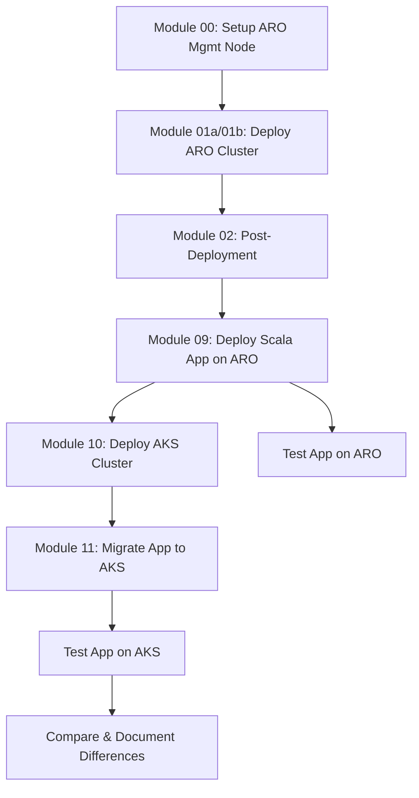
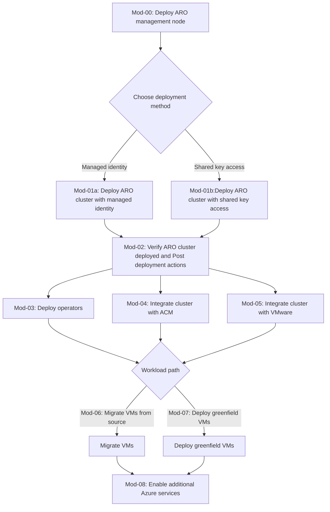

# ARO to AKS Migration Exercise

Repository for guides and scripts to deploy Azure Red Hat OpenShift (ARO) clusters and migrate containerized applications to Azure Kubernetes Service (AKS).

> [!IMPORTANT]  
> This fork extends the original ARO Virtualization repository with a new learning path focused on **containerized application migration from OpenShift to AKS**.
> 
> The original virtualization modules (03-08) are preserved for reference, but the new ARO→AKS migration path follows Modules 00-02, then 09-11.

## Migration Exercise Overview

This repository demonstrates a complete hands-on exercise for:
1. **Deploying an Azure Red Hat OpenShift (ARO) cluster**
2. **Developing and deploying a Scala application on ARO**
3. **Setting up an Azure Kubernetes Service (AKS) cluster**
4. **Migrating the containerized Scala application from ARO to AKS**

## Learning Objectives

- Understand the differences between OpenShift and standard Kubernetes platforms
- Learn migration strategies for containerized workloads
- Convert OpenShift-specific resources to Kubernetes equivalents
- Compare OpenShift Routes, DeploymentConfigs with standard K8s Ingress, Deployments
- Gain hands-on experience with enterprise JVM workload migration

## Workflow

> [!NOTE] 
> The modules in this repository guide through two distinct workflows:

### **NEW: ARO to AKS Migration Path** ⭐



### **Original: ARO Virtualization Path** (Preserved)



## Module Descriptions

### Foundation Modules (Shared)

- **[Module 00](Module-00-aro-mgmt-node-setup.md)**: Set up ARO management node (RHEL on WSL2 with Azure CLI 2.67 + OpenShift CLI)
- **[Module 01a](Module-01a-deploy-aro-cluster-managed-indetities.md)**: Deploy ARO cluster using **managed identities** (preview feature)
- **[Module 01b](Module-01b-deploy-aro-cluster-shared-access-key.md)**: Deploy ARO cluster using **shared key access** (traditional method)
- **[Module 02](Module-02-aro-post-deployment-actions.md)**: Post-deployment verification and configuration

### ARO to AKS Migration Modules (NEW) ⭐

- **Module 09**: Deploy Sample Scala App on ARO *(Coming Soon)*
  - Akka HTTP-based REST API
  - Redis for caching
  - OpenShift Routes and DeploymentConfigs
  - Automated deployment scripts

- **Module 10**: Deploy AKS Cluster *(Coming Soon)*
  - Azure CLI-based deployment
  - Azure Container Registry (ACR) integration
  - Ingress controller setup
  - Azure AD authentication

- **Module 11**: Migrate Application from ARO to AKS *(Coming Soon)*
  - Resource conversion (Routes → Ingress, DeploymentConfigs → Deployments)
  - Image migration to ACR
  - Velero-based migration
  - Manual export/import approach
  - Validation and testing

### Original Virtualization Modules (Preserved)

- **[Module 03](Module-03-deploy-aro-operators.md)**: Install required operators (ACM, MTV, Virtualization)
- **[Module 04](Module-04-integrate-with-acm.md)**: Integrate with Advanced Cluster Management (ACM)
- **[Module 05](Module-05-integrate-with-vmware.md)**: Integrate with VMware for migration
- **[Module 06](Module-06-migrate-vms-from-source.md)**: Migrate VMs from source systems (VMware → ARO)
- **[Module 07](Module-07-deploy-greenfield-vms.md)**: Deploy greenfield VMs (new VMs from scratch)
- **[Module 08](Module-08-integrate-azure-services.md)**: Enable additional Azure services integration

## Technical Specification

For detailed technical design, timelines, and architecture decisions, see the **[SpecKit Documentation](.github/SPEC.md)** *(Coming Soon)*.

### Sample Scala Application Details

**Technology Stack:**
- Scala 2.13 or 3.x
- Akka HTTP 10.x for REST API
- Akka Actors for concurrency
- Circe for JSON serialization
- Redis for caching/session storage
- ScalaTest for testing

**Example API Endpoints:**
```
GET  /health          # Health check
GET  /api/messages    # List cached messages
POST /api/messages    # Add new message to cache
GET  /api/info        # Application info from ConfigMap
```

**Docker Build Strategy:**
- Multi-stage build to reduce image size
- Stage 1: sbt compile and package
- Stage 2: JRE runtime with JAR

### Key Resource Conversion Mappings

| OpenShift Resource | AKS Equivalent | Conversion Notes |
|-------------------|----------------|------------------|
| Route | Ingress | Specify ingress class, TLS config |
| DeploymentConfig | Deployment | Remove triggers, adjust rolling update |
| ImageStream | ACR + Deployment | Push to ACR, update image reference |
| SecurityContextConstraints | PodSecurityPolicy/Standards | Map permissions appropriately |
| Template | Helm Chart | Parameterize values |
| BuildConfig | CI/CD Pipeline | External build system (GitHub Actions, Azure DevOps) |

## Prerequisites

### Azure Resources
- Azure subscription with quota for:
  - ARO cluster (minimum 8-core nodes, Standard_DSv5 SKUs)
  - AKS cluster (comparable sizing)
  - ACR instance
- Red Hat pull secret

### Tools & CLI
- Azure CLI 2.67+
- OpenShift CLI (oc)
- kubectl
- Docker or Podman
- sbt (Scala build tool)
- JDK 11 or 17

### ARO-Specific Requirements
> As of 10/8/2025 the highest OCP version deployed by Azure Resource Manager is 4.17.27. Once deployed, you must update the OCP channel to at least 4.18 to support Virtualization.
> 
> ARO cluster nodes that will have the Virtualization Operator installed must have a minimum of 8 cores assigned and use Standard_DSv5 VM SKUs.
> 
> ARO clusters upgraded to OCP version 4.19 can upgrade to Standard_DSv6 VM SKUs which support NVMe drives.

## Getting Started

### Quick Start: ARO to AKS Migration

```bash
# 1. Clone this repository
git clone https://github.com/dbhimjiyani/MSFT-OpenShift-to-AKS.git
cd MSFT-OpenShift-to-AKS

# 2. Follow Module 00 to set up your management node
# 3. Deploy ARO cluster using Module 01a (managed identity) or 01b (shared key)
# 4. Complete Module 02 post-deployment actions
# 5. Deploy sample Scala app (Module 09) - Coming Soon
# 6. Set up AKS cluster (Module 10) - Coming Soon
# 7. Migrate application (Module 11) - Coming Soon
```

## Project Timeline

### ✅ Phase 1: Foundation (Week 1)
- [x] Fork repository
- [x] Create feature branch
- [x] Update README with migration path
- [ ] Complete Module 00-02 setup
- [ ] ARO cluster deployed and validated

### 🚧 Phase 2: Application Development (Week 1-2)
- [ ] Develop sample Scala app with Akka HTTP
- [ ] Create OpenShift manifests
- [ ] Build and test Docker image
- [ ] Deploy and test on ARO
- [ ] Write Module 09 documentation

### 📋 Phase 3: AKS Setup (Week 2)
- [ ] Deploy AKS cluster
- [ ] Configure ACR
- [ ] Install ingress controller
- [ ] Write Module 10 documentation

### 📋 Phase 4: Migration (Week 2-3)
- [ ] Complete resource conversion
- [ ] Migrate images to ACR
- [ ] Deploy app on AKS
- [ ] Validation tests passing
- [ ] Write Module 11 documentation

### 📋 Phase 5: Documentation (Week 3)
- [ ] Troubleshooting guide
- [ ] Comparison matrix (OpenShift vs AKS)
- [ ] Polish scripts and comments
- [ ] Complete SpecKit documentation

## Repository Structure

```
.
├── Module-00-aro-mgmt-node-setup.md
├── Module-01a-deploy-aro-cluster-managed-indetities.md
├── Module-01b-deploy-aro-cluster-shared-access-key.md
├── Module-02-aro-post-deployment-actions.md
├── Module-09-deploy-scala-app-on-aro.md          # Coming Soon
├── Module-10-setup-aks-cluster.md                # Coming Soon
├── Module-11-migrate-app-to-aks.md               # Coming Soon
├── scripts/
│   ├── managedID-deploy/                         # ARO deployment scripts
│   ├── shared-key-deploy/                        # ARO deployment scripts
│   ├── aks-deploy/                               # Coming Soon
│   ├── migration-toolkit/                        # Coming Soon
│   └── sample-scala-app/                         # Coming Soon
└── assets/
```

## References

### ARO & OpenShift
- [ARO Quickstart CLI Guide](https://review.learn.microsoft.com/en-us/azure/openshift/create-cluster?branch=main&pivots=aro-azure-cli)
- [OpenShift Virtualization Guide](https://review.learn.microsoft.com/en-us/azure/openshift/howto-create-openshift-virtualization?branch=main)
- [Migration Toolkit for Virtualization (MTV)](https://docs.redhat.com/en/documentation/migration_toolkit_for_virtualization/2.8)

### AKS & Migration
- [Azure AKS Documentation](https://learn.microsoft.com/en-us/azure/aks/)
- [OpenShift to Kubernetes Migration Guide](https://docs.openshift.com/container-platform/latest/migration_toolkit_for_containers/about-mtc.html)
- [Velero Documentation](https://velero.io/docs/)
- [Crane Migration Tool (Konveyor)](https://github.com/konveyor/crane)

### Scala & JVM
- [Akka HTTP Documentation](https://doc.akka.io/docs/akka-http/current/)
- [Scala Documentation](https://www.scala-lang.org/)
- [sbt Documentation](https://www.scala-sbt.org/)

## Contributing

This is a learning repository. Feel free to:
- Open issues for questions or suggestions
- Submit PRs for improvements to existing modules
- Share your migration experiences and lessons learned

## Original Repository

This repository is forked from [heisthesisko/Azure_RedHat_OpenShift_Virtualization](https://github.com/heisthesisko/Azure_RedHat_OpenShift_Virtualization). 

The original focus was on VM virtualization on ARO. This fork extends that work with a containerized application migration path to AKS.

## License

See [LICENSE](LICENSE) file for details.
